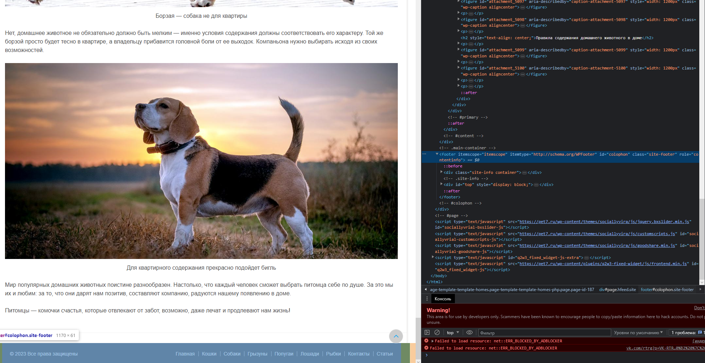

**Урок 1. Веб-технологии: вчера, сегодня, завтра**
Задача: на основе сайта https://pet7.ru/
- Определите, на каком протоколе работает сайт.
- Проанализируйте структуру страницы сайта. Покажите в коде где хедер, футер и контент.
- Внесите не менее 3 изменений на страницу с помощью инструмента разработчика и представьте скриншоты было/стало.
- Создайте прототип низкой детализации.

Сдайте в виде zip-архива со скриншотами результатов, назовите файл по смыслу работы. ИЛИ можете использовать сервис https://www.notion.so/ или в идеале гит.

#
## Решение

## - Определите, на каком протоколе работает сайт. ##

#
## - Проанализируйте структуру страницы сайта. Покажите в коде где хедер, футер и контент.

#

#

#

## - Внесите не менее 3 изменений на страницу с помощью инструмента разработчика и представьте скриншоты было/стало.

#

#

#
## - Создайте прототип низкой детализации.
